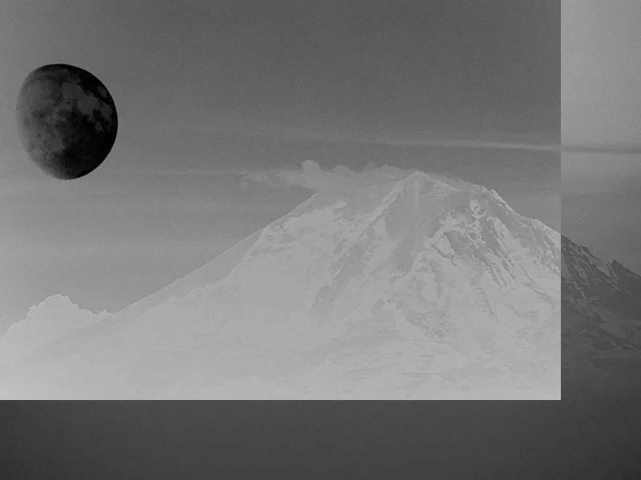

## Exercício 1.1

### Objetivo

Utilizando o programa `exemplos/pixels.cpp` como referência, implemente um programa regions.cpp. Esse programa deverá solicitar ao usuário as coordenadas de dois pontos P1 e P2 localizados dentro dos limites do tamanho da imagem e exibir que lhe for fornecida. Entretanto, a região definida pelo retângulo de vértices opostos definidos pelos pontos P1 e P2 será exibida com o negativo da imagem na região correspondente.

### Implementação

Para os testes, iremos utilizar uma imagem de resolução 800x600 denominada `mountain.png`. Primeiramente, precisamos ler a imagem do disco em modo de escala de cinza, para isso, utilizamos o método `imread()` do OpenCV com o argumento  `cv::IMREAD_GRAYSCALE`. Em seguida, verificamos se a imagem foi carregada corretamente, e caso não, retornamos um erro. Se a operação foi executada com sucesso, entretando, seguimos com a execução do programa, obtemos as dimensões da imagem e a armazenamos em uma variável chamada `imageSize`.

`regions.cpp`

[...]
cv::Mat image =
    cv::imread("../assets/images/mountain.png", cv::IMREAD_GRAYSCALE);

if (!image.data) {
    std::cout << "Error while opening the image.\n";
    return -1;
}

cv::Size imageSize = image.size();
[...]


Então, obtemos os pontos fornecidos pelo usuário, através da função `getPointCoordinates()` e os validamos, com `isAValidPoint()`. A primeira função, utiliza `std::cout` e `std::cin` para printar e coletar informações do usuário no terminal, guardando-as em uma variável do tipo `Point`, as quais guarda as posições x e y. Já a segunda função, verifica se o ponto em questão está dentro do limite das dimensões da imagem, especificado pela variável `imageSize`.

`regions.cpp`

[...]
struct Point p1 = getPointCoordinates("1");
struct Point p2 = getPointCoordinates("2");

if (!isAValidPoint(p1, imageSize)) {
    std::cout << "Invalid coordinates for point P1.\n";
    return -1;
};

if (!isAValidPoint(p2, imageSize)) {
    std::cout << "Invalid coordinates for point P2.\n";
    return -1;
};
[...]


Após isso, percorremos a matrix da imagem horizontalmente e verticalmente, de acordo com os pontos fornecidos, e para cada ponto, substituimos seu valor pelo seu complemento, com base no total de 255 tons que podemos representar utilizando 8 bits. Por fim, usamos `imshow()` para mostrar a imagem resultante.

`regions.cpp`

[...]
for (int i = p1.x; i < p2.x; i++) {
    for (int j = p1.y; j < p2.y; j++) {
        image.at<uchar>(i, j) = 255 - image.at<uchar>(i, j);
    }
}

cv::imshow("window", image);
cv::waitKey();
[...]


### Resultados


*Imagem original (mountain.png)*

Utilizando os valores

```bash
$ make regions && ./regions

> Point 1 coordinates
x: 0
y: 0

> Point 2 coordinates
x: 500
y: 700
```

Obtemos a seguinte imagem:


*Imagem processada*

## Exercício 1.2

### Objetivo

Utilizando o programa `exemplos/pixels.cpp` como referência, implemente um programa `trocaregioes.cpp`. Seu programa deverá trocar os quadrantes em diagonal na imagem. Explore o uso da classe Mat e seus construtores para criar as regiões que serão trocadas.

### Implementação

Assim como no exercício 1.1, primeiramente lemos a imagem em disco, verificamos se a operação foi executada corretamente e obtemos suas dimensões.

`trocaregioes.cpp`

[...]
cv::Mat image =
    cv::imread("../assets/images/mountain.png", cv::IMREAD_GRAYSCALE);

int imageWidth = image.size().width;
int imageHeight = image.size().height;

if (!image.data)
    std::cout << "Error while opening the image.\n";
[...]


Então, geramos uma nova matriz composta de zeros, de mesma dimensão e tipo da imagem fornecida, por meio do método `zeros()`. De posse dela, percorremos cada quadrante da imagem original, com base em sua altura e largura, e atribuimos cada valor ao quadrante inverso na nova matriz `newImage`.

Os quadrantes podem ser definidos dividindo a imagem 4 partes, levando em consideração os pontos `(0,0)`, `(largura/2, altura/2)`, `(largura, altura)` e suas variações.

`trocaregioes.cpp`

[...]
cv::Mat newImage = cv::Mat::zeros(imageHeight, imageWidth, CV_8UC1);

// First quadrant
for (int i = 0; i < imageHeight / 2; i++) {
    for (int j = 0; j < imageWidth / 2; j++) {
        newImage.at<uchar>(imageHeight / 2 + i, imageWidth / 2 + j) =
            image.at<uchar>(i, j);
    }
}

// Second quadrant
for (int i = 0; i < imageHeight / 2; i++) {
    for (int j = imageWidth / 2; j < imageWidth; j++) {
        newImage.at<uchar>(imageHeight / 2 + i - 1, imageWidth / 2 + j) =
            image.at<uchar>(i, j);
    }
}

// Third quadrant
for (int i = imageHeight / 2; i < imageHeight; i++) {
    for (int j = 0; j < imageWidth / 2; j++) {
        newImage.at<uchar>(i - imageHeight / 2, j + imageWidth / 2) =
            image.at<uchar>(i, j);
    }
}

// Forth quadrant
for (int i = imageHeight / 2; i < imageHeight; i++) {
    for (int j = imageWidth / 2; j < imageWidth; j++) {
        newImage.at<uchar>(i - imageHeight / 2, j - imageWidth / 2) =
            image.at<uchar>(i, j);
    }
}
[...]


### Resultados


*Imagem original (mountain.png)*

Após a execução do programa, obtemos a seguinte imagem:


*Imagem processada*