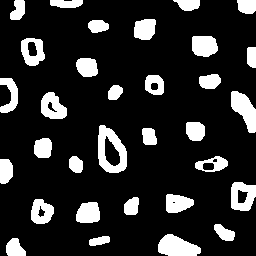
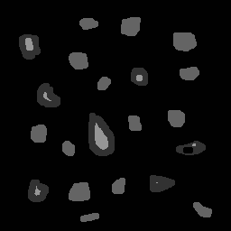

## Exercício 2.1

### Objetivo

Observando-se o programa `labeling.cpp` como exemplo, é possível verificar que caso existam mais de 255 objetos na cena, o processo de rotulação poderá ficar comprometido. Identifique a situação em que isso ocorre e proponha uma solução para este problema.

### Solução

O problema ocorre devido ao fato do algoritmo usar a variável que conta a quantidade de objetos, `nobjects`, como tonalidade de cinza a ser preenchida pelo `floodFill()`, assim, como 255 é o número máximo representável com 8 bits do tipo `uchar`, com uma quantidade de objetos maior que essa, o algoritmo irá gerar um resultado errôneo.

Uma possível solução é utilizar o sistema RGB, sabido que será possível contar `255*255*255 = 1.6581.375` objetos na cena.

## Exercício 2.2

### Objetivo

Aprimore o algoritmo de contagem apresentado para identificar regiões com ou sem buracos internos que existam na cena. Assuma que objetos com mais de um buraco podem existir. Inclua suporte no seu algoritmo para não contar bolhas que tocam as bordas da imagem. Não se pode presumir, a priori, que elas tenham buracos ou não.

### Implementação

A fim de detectar bolhas que tocam as bordas da imagem, foi percorrida toda a imagem, e caso houvesse um pixel de cor branca, simbolizando uma bolha, foi utilizado o algoritmo de `floodFill` para preencher a bolha com a cor do fundo (preto).

`labeling.cpp`

[...]
// remove objetos que tocam na borda
for (int i = 0; i < height; i++) {
    for (int j = 0; j < width; j++) {
        // se o pixel não for um pixel de borda, continue
        if ((i > 0 && i < height - 1) && (j > 0 && j < width - 1)) {
            continue;
        }

        p.x = j;
        p.y = i;

        // se houver uma bolha, a remove
        if (image.at<uchar>(i, j) == 255) {
            cv::floodFill(image, p, 0);
        }
    }
}
[...]


Então, resetamos o ponto que itera sobre a imagem e mudamos a cor de fundo, para que não sejam contados mais de um buraco em cada bolha. Contamos, portanto, o número de bolhas, iterando sobre a imagem e checando se o pixel possui cor branca, se sim, pintamos a bolha com uma tonalidade de cinza padrão.

`labeling.cpp`

[...]
// reseta o ponto
p.x = 0;
p.y = 0;

// muda a cor do fundo
floodFill(image, p, 1);

// conta quantas bolhas existem
int numberOfObjects = 0;
for (int i = 0; i < height; i++) {
    for (int j = 0; j < width; j++) {
        if (image.at<uchar>(i, j) == 255) {
            numberOfObjects++;
            p.x = j;
            p.y = i;
            floodFill(image, p, 100);
        }
    }
}
[...]


Por fim, para contar quantas bolhas com buracos existem, percorremos a imagem e checamos se cada pixel possui cor preta e seu vizinho possui a cor de uma bolha. Se sim, uma bolha com buraco foi encontrada. Usamos o pixel em questão e seu vizinho para pintar suas áreas com cores não usadas anteriormente. 

`labeling.cpp`

[...]
// reseta o ponto
p.x = 0;
p.y = 0;

// conta quantas bolhas com buracos existem
int numberOfObjectsWithHoles = 0;
for (int i = 0; i < height; i++) {
    for (int j = 0; j < width; j++) {
        if (image.at<uchar>(i, j) == 0 &&
            image.at<uchar>(i, j - 1) == 100) {
            numberOfObjectsWithHoles++;
            p.x = j;
            p.y = i;
            floodFill(image, p, 150);
            p.x = j - 1;
            floodFill(image, p, 50);
        }
    }
}
[...]


### Resultados

A imagem original foi modificada, adicionando um buraco a mais a uma bolha que já havia um.


*Imagem original*

Depois de executado, obtemos

`output`
```bash
256x256
a figura tem 21 bolhas e 7 bolhas com buracos.
```


*Imagem após remover as bolhas das bordas*


*Imagem resultante*