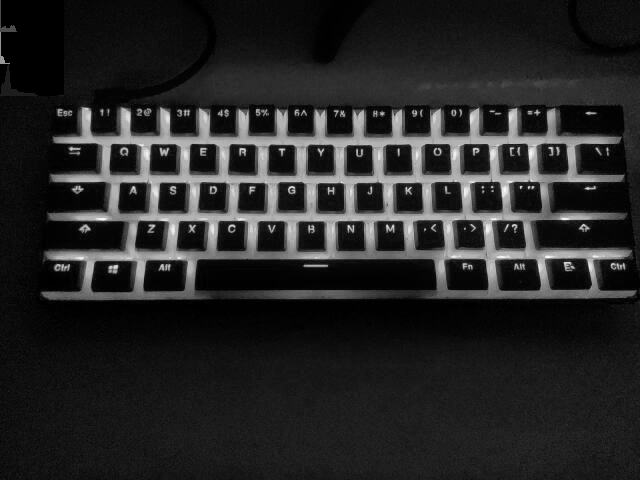
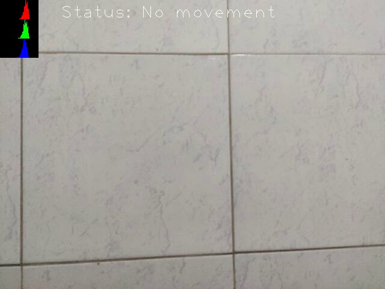
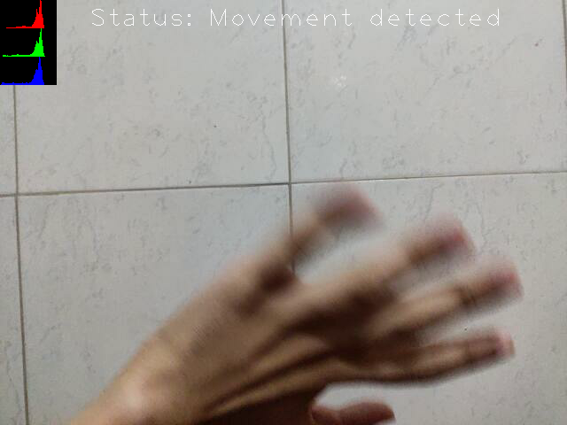

## Exercício 3.1

### Objetivo

Utilizando o programa `exemplos/histogram.cpp` como referência, implemente um programa `equalize.cpp`. Este deverá, para cada imagem capturada, realizar a equalização do histogram antes de exibir a imagem. Teste sua implementação apontando a câmera para ambientes com iluminações variadas e observando o efeito gerado. Assuma que as imagens processadas serão em tons de cinza.

### Implementação

Assumindo que as imagens processadas serão em tons de cinza, primeiro temos que convertê-las. Para isso, foi utilizado a função `cvtColor`, passando a imagem capturada e o argumento `cv::COLOR_BGR2GRAY`, sinalizando que queremos converter de BGR para escala de cinza. A partir disso, criamos uma nova matriz para armazenar a imagem equalizada, e utilizamos a função `equalizeHist`, passando a imagem de origem e a de destino, como mostrado nas linhas `4-6`. Por fim, mostramos ambas imagens em janelas separadas.

`equalize.cpp`

[...]
cv::cvtColor(image, image, cv::COLOR_BGR2GRAY);

cv::Mat equalizedImage;

cv::equalizeHist(image, equalizedImage);

cv::imshow("image", image);
cv::imshow("equalized image", equalizedImage);
[...]


### Resultados

Após executar o programa, obtemos duas janelas, onde em uma as imagens do vídeo não estão equalizadas e na outra estão, conforme as imagens a seguir.

_Imagem não equalizada_

_Imagem equalizada_

## Exercício 3.2

### Objetivo

Utilizando o programa `exemplos/histogram.cpp` como referência, implemente um programa `motiondetector.cpp`. Este deverá continuamente calcular o histograma da imagem (apenas uma componente de cor é suficiente) e compará-lo com o último histograma calculado. Quando a diferença entre estes ultrapassar um limiar pré-estabelecido, ative um alarme. Utilize uma função de comparação que julgar conveniente.

### Implementação

Para calcular a diferença entre o histograma mais recente e seu anterior, criamos duas variáveis para guardar a soma de cada histograma, como mostrado na linha `1`. Além disso, foi criada uma nova matriz `lastHistImgR` que servirá como _backup_ do canal de cor escolhido, o vermelho.

`motion_detector.cpp`

[...]
int currentHistSum = 0, lastHistSum = 0;

cv::Mat histImgR(histh, histw, CV_8UC3, cv::Scalar(0, 0, 0));
cv::Mat histImgG(histh, histw, CV_8UC3, cv::Scalar(0, 0, 0));
cv::Mat histImgB(histh, histw, CV_8UC3, cv::Scalar(0, 0, 0));
cv::Mat lastHistImgR(histh, histw, CV_8UC3, cv::Scalar(0, 0, 0));
[...]


Para cada quadro capturado, as somas são realizadas percorrendo todo o histograma — como ambos possuem o mesmo tamanho, é possível usar os valores de altura e largura pré-definidos, `histh` e `histw` — e incrementando as variáveis de soma com os valores de cada posição, como mostrado nas linhas `2-7`.

Então, para definir se houve movimento, realizamos a diferença entre os histogramas (`comparationResult`) e definimos um limiar (`detectionThreshold`), obtido de maneira empírica. Se a diferença for maior que esse limiar, então houve movimento e exibimos o texto "Movement detected", caso contrário, exibimos "No movement".

O _status_ é mostrado na tela por meio da função `putText`, especificando a imagem em questão, o texto a ser exibido, sua posição, estilo da fonte e cor.

`motion_detector.cpp`

[...]
for (int i = 0; i < histh; i++) {
    for (int j = 0; j < histw; j++) {
        lastHistSum += lastHistImgR.at<uchar>(i, j);
        currentHistSum += histImgR.at<uchar>(i, j);
    }
}

double comparationResult = abs(currentHistSum - lastHistSum);
int detectionThreshold = 1000;
cv::String status = comparationResult >= detectionThreshold
                        ? "Movement detected"
                        : "No movement";

cv::putText(image, "Status: " + status, cv::Point(100, 30),
            cv::FONT_HERSHEY_PLAIN, 2, cv::Scalar(250, 250, 250), 1,
            cv::FILLED);

cv::imshow("image", image);
[...]


### Resultados

_Imagem sem movimento na cena_

_Imagem com movimento na cena_
