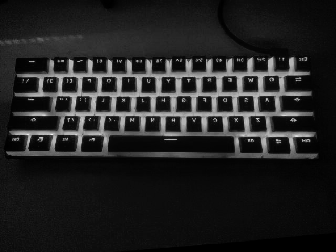
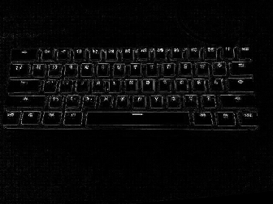
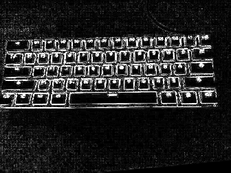

## Exercício 4.1

### Objetivo

Utilizando o programa `exemplos/filtroespacial.cpp` como referência, implemente um programa `laplgauss.cpp`. O programa deverá acrescentar mais uma funcionalidade ao exemplo fornecido, permitindo que seja calculado o laplaciano do gaussiano das imagens capturadas. Compare o resultado desse filtro com a simples aplicação do filtro laplaciano.

### Implementação

O filtro Laplaciano do Gaussiano pode ser obtido utilizando a seguinte máscara 5x5:

| 0  | 0  | -1 | 0  | 0  |
|----|----|----|----|----|
| 0  | -1 | -2 | -1 | 0  |
| -1 | -2 | 16 | -2 | -1 |
| 0  | -1 | -2 | -1 | 0  |
| 0  | 0  | -1 | 0  | 0  |

Então, primeiramente criamos uma nova matriz contendo os valores da máscara, chamada `gaussLaplacian`,

`laplgauss.cpp`

[...]
float media[] = {0.1111, 0.1111, 0.1111, 0.1111, 0.1111,
                    0.1111, 0.1111, 0.1111, 0.1111};
float gauss[] = {0.0625, 0.125,  0.0625, 0.125, 0.25,
                    0.125,  0.0625, 0.125,  0.0625};
float horizontal[] = {-1, 0, 1, -2, 0, 2, -1, 0, 1};
float vertical[] = {-1, -2, -1, 0, 0, 0, 1, 2, 1};
float laplacian[] = {0, -1, 0, -1, 4, -1, 0, -1, 0};
float boost[] = {0, -1, 0, -1, 5.2, -1, 0, -1, 0};
float gaussLaplacian[] = {0,  0,  -1, 0,  0,  0,  -1, -2, -1,
                            0,  -1, -2, 16, -2, -1, 0,  -1, -2,
                            -1, 0,  0,  0,  -1, 0,  0};
[...]


E adicionamos uma nova ação ao pressionar uma tecla, nesse caso, pressionando a tecla `o`. Nessa ação, é atribuida à variável `mask` uma nova matriz baseada em `gaussLaplacian`, de largura = 5 e altura = 5.

`laplgauss.cpp`

[...]
case 'l':
    mask = cv::Mat(3, 3, CV_32F, laplacian);
    printmask(mask);
    break;
case 'b':
    mask = cv::Mat(3, 3, CV_32F, boost);
    break;
case 'o':
    mask = cv::Mat(5, 5, CV_32F, gaussLaplacian);
    printmask(mask);
    break;
default:
    break;
[...]


### Resultados

Após executar o programa, obtemos duas janelas, onde em uma está a imagem original e na outra, o resultado dos filtros, conforme as imagens a seguir.

_Imagem original_

Ao pressionar a tecla `l`, o resultado do filtro Laplaciano é:

_Imagem filtrada utilizando o Laplaciano_

E ao pressionar a tecla `o`, o resultado do filtro Laplaciano do Gaussiano é:

_Imagem filtrada utilizando o Laplaciano do Gaussiano_
