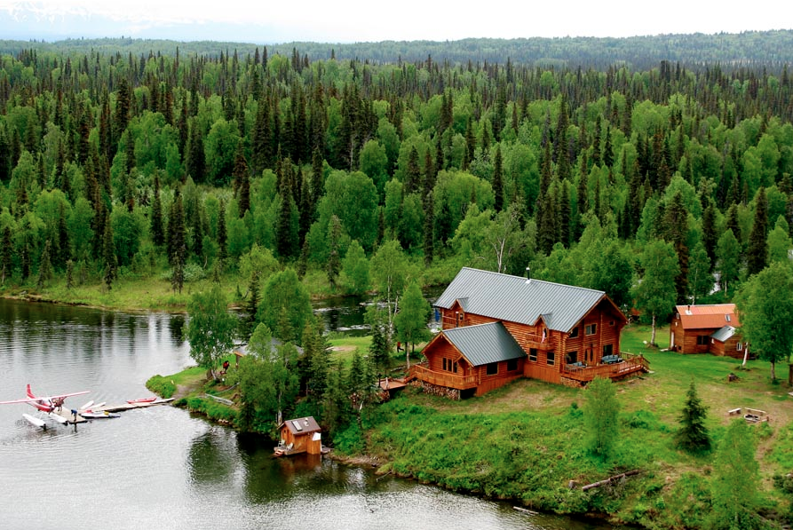
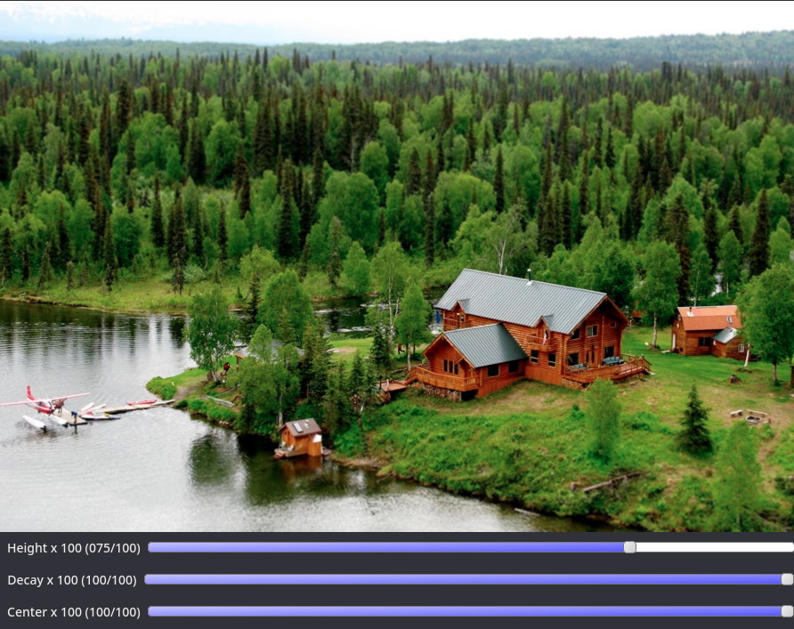

## Exercício 5.1

### Objetivo

Utilizando o programa `exemplos/addweighted.cpp` como referência, implemente um programa `tiltshift.cpp`. Três ajustes deverão ser providos na tela da interface:
- um ajuste para regular a altura da região central que entrará em foco;
- um ajuste para regular a força de decaimento da região borrada;
- um ajuste para regular a posição vertical do centro da região que entrará em foco. Finalizado o programa, a imagem produzida deverá ser salva em arquivo.

### Implementação

Para realizar o efeito de borramento, primeiramente foi aplicado o filtro da média na imagem original e seu resultado armazenado em uma nova matriz denominada `filteredImage`.

`tiltshift.cpp`

[...]
float media[] = {0.1111, 0.1111, 0.1111, 0.1111, 0.1111,
                    0.1111, 0.1111, 0.1111, 0.1111};

cv::Mat mask = cv::Mat(3, 3, CV_32F, media);

cv::filter2D(image, filteredImage, image.depth(), mask, cv::Point(1, 1), 0);

filteredImage.copyTo(imageTop);
[...]


O programa conta com 3 _sliders_, sendo eles: o ajuste para regular a altura da região central que entrará em foco, o ajuste para regular a força de decaimento da região borrada e o ajuste para regular a posição vertical do centro da região que entrará em foco. Cada slider depende de um _callback_, de seu valor inicial/atual e máximo. Esses são definidos da seguinte maneira:

`tiltshift.cpp`

[...]
std::sprintf(TrackbarName, "Height x %d", height_slider_max);
cv::createTrackbar(TrackbarName, "addweighted", &height_slider,
                    height_slider_max, on_trackbar_height);
on_trackbar_height(height_slider, 0);

std::sprintf(TrackbarName, "Decay x %d", decay_slider_max);
cv::createTrackbar(TrackbarName, "addweighted", &decay_slider,
                    decay_slider_max, on_trackbar_decay);
on_trackbar_decay(decay_slider, 0);

std::sprintf(TrackbarName, "Center x %d", center_slider_max);
cv::createTrackbar(TrackbarName, "addweighted", &center_slider,
                    center_slider_max, on_trackbar_center);
on_trackbar_center(center_slider, 0);
[...]


A função `on_trackbar_decay` é responsável por mudar o decaimento, e utiliza como base a equação fornecida no tutorial, que define a ponderação da imagem, `alpha`. Para cada linha da imagem, o alpha é calculado e o resultado é combinado utilizando a função `addWeighted`, dada no exemplo. A equação que define alpha necessita de dois valores, l1 e l2, que representam as linhas cujo valor de alpha assume valor em torno de 0,5. Os demais sliders atribuem à essas variáveis valores de acordo com que o valor do slider seja modificado, e ao final, chamam a função de decaimento, para que a nova imagem seja mostrada em tela.

`tiltshift.cpp`

[...]
void on_trackbar_decay(int, void *) {
    for (int i = 0; i < filteredImage.rows; i++) {
        double d = (double)decay_slider;
        double alpha = (0.5) * (tanh((i - l1) / d) - tanh((i - l2) / d));

        cv::addWeighted(image.row(i), alpha, imageTop.row(i), 1 - alpha, 0,
                    filteredImage.row(i));
    }

    cv::imshow("addweighted", filteredImage);
}

void on_trackbar_height(int, void *) {
    l1 = height_slider - center_slider + round(image.size().height / 2);
    l2 = height_slider + center_slider + round(image.size().height / 2);
    on_trackbar_decay(decay_slider, 0);
}

void on_trackbar_center(int, void *) {
    l1 = height_slider - center_slider + round(image.size().height / 2);
    l2 = height_slider + center_slider + round(image.size().height / 2);
    on_trackbar_decay(decay_slider, 0);
}
[...]


### Resultados

_Imagem original_

Selecionando a altura como 75, decaimento como 100 e a posição do centro como 100, obtemos um foco na casa principal.

_Imagem filtrada demo_

O resultado é a seguinte imagem:

_Imagem filtrada_

## Exercício 5.2

### Objetivo

Utilizando o programa `exemplos/addweighted.cpp` como referência, implemente um programa `tiltshiftvideo.cpp`. Tal programa deverá ser capaz de processar um arquivo de vídeo, produzir o efeito de tilt-shift nos quadros presentes e escrever o resultado em outro arquivo de vídeo. A ideia é criar um efeito de miniaturização de cenas. Descarte quadros em uma taxa que julgar conveniente para evidenciar o efeito de stop motion, comum em vídeos desse tipo.

### Implementação

A fim de processar cada frame do vídeo e exportá-los para um novo arquivo, foram utilizadas as classes `VideoCapture` e `VideoWriter` do OpenCV. Para o vídeo resultante, além de seu nome, formato e tamanho, também foi lhe atribuido a taxa de quadros de 15 FPS, com o objetivo de recriar o efeito de stop motion.

`tiltshiftvideo.cpp`

[...]
cv::VideoCapture cap("./exercises/5/norway.mp4");
int frameWidth = cap.get(cv::CAP_PROP_FRAME_WIDTH);
int frameHeight = cap.get(cv::CAP_PROP_FRAME_HEIGHT);
cv::VideoWriter output("./exercises/5/norway_output.avi",
                        cv::VideoWriter::fourcc('M', 'J', 'P', 'G'), 15,
                        cv::Size(frameWidth, frameHeight));
[...]


Similarmente ao processo realizado em `tiltshift.cpp`, o filtro da média foi aplicado a cada frame. Com o intuito de intensificar o borramento, o filtro foi aplicado mais 5 vezes, como mostrado nas linhas `L12-L15`.

Em seguida, foi efetuada a ponderação (dessa vez com valores pré-definidos, pois não há sliders) e a escrita do frame no arquivo de vídeo final.

`tiltshiftvideo.cpp`

[...]
while (1) {
    cv::Mat frame, filteredFrame, frameTop;
    cap >> frame;

    if (frame.empty()) {
        break;
    }

    cv::filter2D(frame, filteredFrame, frame.depth(), mask, cv::Point(1, 1),
                    0);
    for (int i = 0; i < 5; i++) {
        cv::filter2D(filteredFrame, filteredFrame, frame.depth(), mask,
                        cv::Point(1, 1), 0);
    }
    filteredFrame.copyTo(frameTop);

    for (int i = 0; i < filteredFrame.rows; i++) {
        double d = 100.0;
        double l1 = -200.0 + round(frame.size().height / 2);
        double l2 = 200.0 + round(frame.size().height / 2);
        double alpha = (0.5) * (tanh((i - l1) / d) - tanh((i - l2) / d));

        addWeighted(frame.row(i), alpha, frameTop.row(i), 1 - alpha, 0,
                    filteredFrame.row(i));
    }

    output.write(filteredFrame);
}
[...]


### Resultados

**Video original**
<iframe width="854" height="480" src="https://www.youtube.com/embed/q54EgS8sdYQ" frameborder="0" allowfullscreen></iframe>

**Video com efeito Tilt-shift**
<iframe width="854" height="480" src="https://www.youtube.com/embed/ubLREjGYT5Y" frameborder="0" allowfullscreen></iframe>
