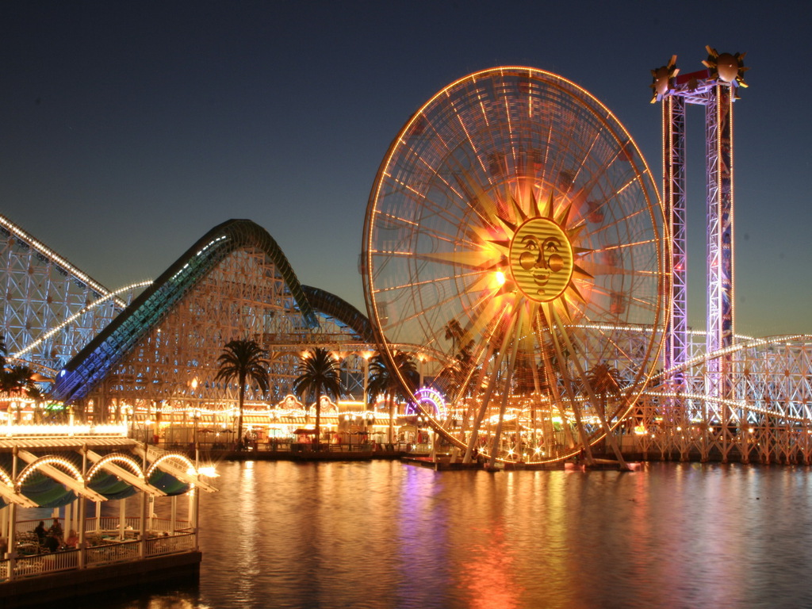
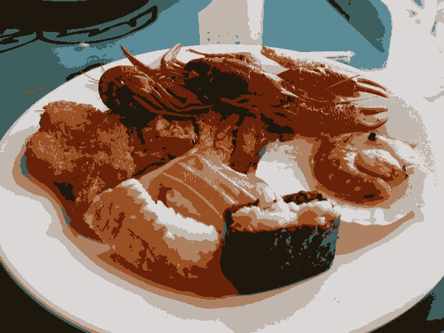

## Exercício 8

### Objetivo

Utilizando o programa `kmeans.cpp` como exemplo prepare um programa exemplo onde a execução do código se dê usando o parâmetro `nRodadas=1` e iniciar os centros de forma aleatória usando o parâmetro `KMEANS_RANDOM_CENTERS` ao invés de `KMEANS_PP_CENTERS`. Realize 10 rodadas diferentes do algoritmo e compare as imagens produzidas. Explique porque elas podem diferir tanto.

### Implementação

Modificando o número de rodadas, inserindo o parâmetro `KMEANS_RANDOM_CENTERS` e realizando 10 iterações através de um loop, temos:

`kmeans.cpp`

[...]
for (int i = 0; i < 10; i++) {
    int nClusters = 8;
    Mat rotulos;
    int nRodadas = 1;
    Mat centros;

    Mat img = imread(argv[1], cv::IMREAD_COLOR);
    Mat samples(img.rows * img.cols, 3, CV_32F);

    for (int y = 0; y < img.rows; y++) {
        for (int x = 0; x < img.cols; x++) {
            for (int z = 0; z < 3; z++) {
                samples.at<float>(y + x * img.rows, z) =
                    img.at<Vec3b>(y, x)[z];
            }
        }
    }

    kmeans(samples, nClusters, rotulos,
            TermCriteria(TermCriteria::MAX_ITER | TermCriteria::EPS, 10000,
                        0.0001),
            nRodadas, KMEANS_RANDOM_CENTERS, centros);

    Mat rotulada(img.size(), img.type());

    for (int y = 0; y < img.rows; y++) {
        for (int x = 0; x < img.cols; x++) {
            int indice = rotulos.at<int>(y + x * img.rows, 0);
            rotulada.at<Vec3b>(y, x)[0] =
                (uchar)centros.at<float>(indice, 0);
            rotulada.at<Vec3b>(y, x)[1] =
                (uchar)centros.at<float>(indice, 1);
            rotulada.at<Vec3b>(y, x)[2] =
                (uchar)centros.at<float>(indice, 2);
        }
    }

    char output[50];

    sprintf(output, "./exercises/8/output%d.jpg", i + 1);

    imwrite(output, rotulada);
}
[...]


### Resultados

*Imagem original*

Após executar o programa e obter as 10 imagens, foi utilizado o site ezgif.com para criar um GIF mostrando cada uma delas em ordem.

*10 iterações de kmeans com nRodadas = 1*

O efeito apresentado dá-se devido à aleatoriedade da escolha de centros, porporcionada pelo parâmetro `KMEANS_RANDOM_CENTERS`.