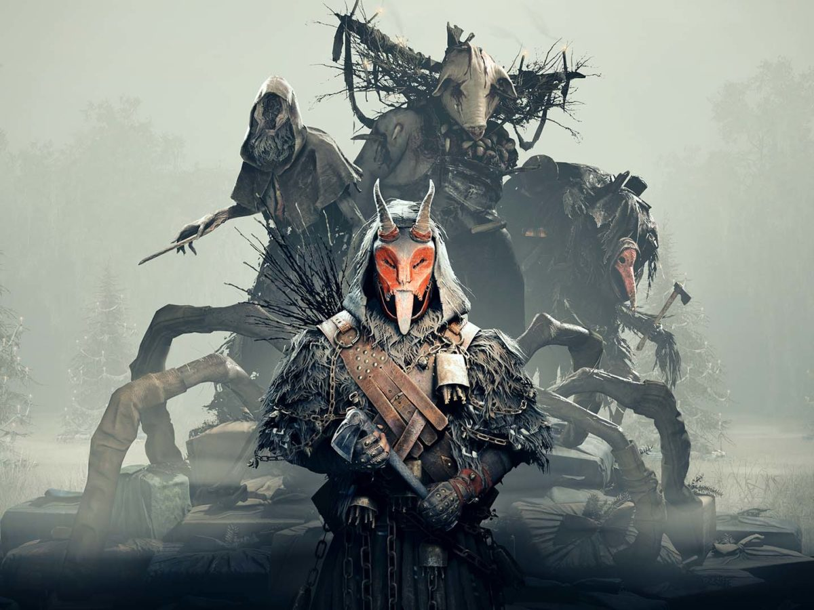

## Exercício 7

### Objetivo

- Utilizando os programas `exemplos/canny.cpp` e `exemplos/pontilhismo.cpp` como referência, implemente um programa `cannypoints.cpp`. A idéia é usar as bordas produzidas pelo algoritmo de Canny para melhorar a qualidade da imagem pontilhista gerada. A forma como a informação de borda será usada é livre. Entretanto, são apresentadas algumas sugestões de técnicas que poderiam ser utilizadas:

    - Desenhar pontos grandes na imagem pontilhista básica;

    - Usar a posição dos pixels de borda encontrados pelo algoritmo de Canny para desenhar pontos nos respectivos locais na imagem gerada.

    - Experimente ir aumentando os limiares do algoritmo de Canny e, para cada novo par de limiares, desenhar círculos cada vez menores nas posições encontradas. A Figura 19 foi desenvolvida usando essa técnica.

- Escolha uma imagem de seu gosto e aplique a técnica que você desenvolveu.

- Descreva no seu relatório detalhes do procedimento usado para criar sua técnica pontilhista.

### Implementação

Com base nos dois programas fornecidos, foi elaborado o seguinte algoritmo para alcançar um resultado similar ao da Figura 19:

1. Aplicar Canny com um threshold pré-definido
2. Realizar a pintura dos pontos maiores que compõem a imagem
3. Realizar consecutivas pinturas (10, no exemplo mostrado) de pontos menores nas bordas encontradas por Canny 
4. Testar se o threshold é adequado, caso não seja, mudar seu valor e repetir o processo novamente

Por fim, o valor 30 pareceu o mais adequado para a imagem utilizada.

`cannypoints.cpp`

[...]
int cannyThreshold = 30;
Canny(image, border, cannyThreshold, 3 * cannyThreshold);

xrange.resize(height / STEP);
yrange.resize(width / STEP);

iota(xrange.begin(), xrange.end(), 0);
iota(yrange.begin(), yrange.end(), 0);

for (uint i = 0; i < xrange.size(); i++) {
    xrange[i] = xrange[i] * STEP + STEP / 2;
}

for (uint i = 0; i < yrange.size(); i++) {
    yrange[i] = yrange[i] * STEP + STEP / 2;
}

points = Mat(height, width, CV_8U, Scalar(255));

random_shuffle(xrange.begin(), xrange.end());

for (auto i : xrange) {
    random_shuffle(yrange.begin(), yrange.end());
    for (auto j : yrange) {
        x = i + rand() % (2 * JITTER) - JITTER + 1;
        y = j + rand() % (2 * JITTER) - JITTER + 1;
        gray = image.at<uchar>(x, y);

        circle(points, cv::Point(y, x), RAIO, CV_RGB(gray, gray, gray), -1,
                cv::LINE_AA);
    }
}

for (int i = 0; i < 10; i++) {
    for (auto i : xrange) {
        random_shuffle(yrange.begin(), yrange.end());
        for (auto j : yrange) {
            x = i + rand() % (2 * JITTER) - JITTER + 1;
            y = j + rand() % (2 * JITTER) - JITTER + 1;
            gray = image.at<uchar>(x, y);

            if (border.at<uchar>(x, y) == 255) {
                circle(points, cv::Point(y, x), RAIO - 2,
                        CV_RGB(gray, gray, gray), -1, cv::LINE_AA);
            }
        }
    }
}

imshow("points", points);
[...]


### Resultados

*Imagem original*

Após executado o programa, obtemos a seguinte imagem:

*Imagem pontilhista*
