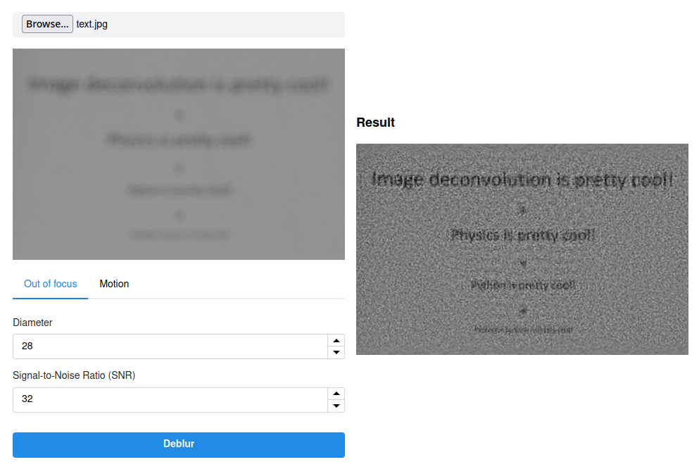

## Embasamento teórico

Em uma imagem desfocada, todas as informações estão redistribuídas de acordo com algumas regras e podem ser restauradas admitindo algumas suposições. Como a maioria dos ruídos periódicos, estes são melhor tratados utilizando o domínio do frequência. Para tratá-los, precisamos de um filtro que faça a remoção do borramento (Hw) e do espectro de frequência da imagem borrada (S), conforme a seguinte equação:

**U' = Hw ⋅ S** (I)
{: style="color:gray; font-size: 130%; text-align: center;"}

O espectro da imagem degradada pode ser descrito como o produto da resposta em frequência da Função de Dispersão de Ponto (PSF, do inglês), H, com o espectro da imagem original, sem borramento, U, acrescido do espectro do ruído presente, N.

**S = H⋅U+N** (II)
{: style="color:gray; font-size: 130%; text-align: center;"}

A PSF representa a resposta ao impulso de um sistema óptico focado. Para imagens homogeneamente desfocadas, a PSF circular consegue gerar uma boa aproximação para esse tipo de distorção. Dessa forma, para adequá-la precisamos apenas de um valor para seu raio ou diametro. 

*Figura 1: Formação de imagem em um microscópio confocal a partir da convolução das fontes de luz reais com a PSF*

Um dos filtros mais utilizados para esse tipo de tarefa é o Filtro de Wiener. A deconvolução de Wiener é uma aplicação do filtro de Wiener aos problemas de ruído inerentes à deconvolução. Ele funciona no domínio da frequência, tentando minimizar o impacto do ruído deconvoluído em frequências que possuem uma má relação sinal-ruído, e pode ser descrito com base no sistema ou imagem original e a razão sinal-ruído (SNR, do inglês).

*Figura 2: Filtro de Wiener aplicado à deconvolução*

Por fim, de posse do filtro de deconvolução e do espectro da imagem borrada, podemos utilizar a equação (I).

## Aplicação

### Visão geral

O projeto é dividido em duas partes: WebApp (construído em HTML, CSS e JS) e API (construída em Python). O WebApp é responsável tanto pela exibição e controle da interface de usuário, como também pelo envio e recebimento dos dados da API. A API  recebe a requisição, processa a imagem de acordo com os parâmetros fornecidos e retorna uma nova imagem, que será posteriormente exibida na interface.

A comunicação ocorre via requisições HTTP. A interface envia uma requisição do tipo POST com a imagem original, fornecida pelo usuário, e os parâmetros necessários para o filtro em questão. Após o processamento, a API retorna a imagem processada.

*Figura 3: Comunicação entre a interface e a API*

### Filtragem

A filtragem é realizada pela classe `ImageDeblur`. Nela, são passados os parâmetros do filtro pelo seu construtor, e a imagem em binário, pelo método `deblur`. Este método utiliza-se da classe auxiliar `ImageConverter` tanto para converter de bytes para imagem (isto é, para uma matriz processável), como de imagem para bytes, para ser enviada à interface, ao final do processo.

Inicialmente, para obter a imagem no domínio da frequência, ela é normalizada, suas bordas são borradas, com o auxílio de um filtro Gaussiano, e uma nova imagem é gerada a partir do cálculo da Transformada Discreta de Fourier (DFT). A aplicação possui dois modos: para imagens fora de foco e imagens com borrão de movimento. Para distinguir dos dois modos, é analisado se foi fornecido o parâmetro de ângulo do movimento, caso verdadeiro, este ângulo é convertido de graus para radianos e é chamado o método `motion_kernel`, caso contrário, o método `defocus_kernel` é chamado. Ambos os métodos geram uma PSF, que será utilizada posteriormente. A Figura 4 mostra um exemplo de PSF circular gerada pelo segundo método.

*Figura 4: Exemplo de PSF circular gerada por `defocus_kernel`*

Em seguida, devido ao tamanho da PSF, é realizado um *padding*, preenchendo suas bordas com zeros, para que seja calculada sua DFT. Por fim, o filtro de Wiener é calculado e o multiplicamos com o espectro da imagem original, conforme visto na equação (I).

`deblur.py`

class ImageDeblur:
    def __init__(self, d, snr, angle):
        self.d = d
        self.snr = snr
        self.angle = angle

    [...]

    def defocus_kernel(self, d, sz=65):
        kern = np.zeros((sz, sz), np.uint8)
        cv.circle(kern, (sz, sz), d, 255, -1, cv.LINE_AA, shift=1)
        kern = np.float32(kern) / 255.0
        return kern

    def deblur(self, image):
        img = ImageConverter.from_bytes_to_image(image)
        img = np.float32(img)/255.0
        img = self.blur_edge(img)
        IMG = cv.dft(img, flags=cv.DFT_COMPLEX_OUTPUT)

        d = self.d
        noise = 10**(-0.1*self.snr)

        if self.angle is not None:
            angle = np.deg2rad(self.angle)
            psf = self.motion_kernel(angle, d)
        else:
            psf = self.defocus_kernel(d)

        psf /= psf.sum()
        psf_pad = np.zeros_like(img)
        kh, kw = psf.shape
        psf_pad[:kh, :kw] = psf
        PSF = cv.dft(psf_pad, flags=cv.DFT_COMPLEX_OUTPUT, nonzeroRows=kh)
        PSF2 = (PSF**2).sum(-1)
        iPSF = PSF / (PSF2 + noise)[..., np.newaxis]
        RES = cv.mulSpectrums(IMG, iPSF, 0)
        res = cv.idft(RES, flags=cv.DFT_SCALE | cv.DFT_REAL_OUTPUT)
        res = np.roll(res, -kh//2, 0)
        res = np.roll(res, -kw//2, 1)
        res = ImageConverter.from_image_to_bytes(255*res)

        return res


## Resultados

Ao escolher uma imagem fora de foco que possui vários textos, após ajuste dos parâmetros e tratamento, podemos enxergar o que está escrito, como mostrado na Figura 5.

*Figura 5: Resultado da restauração*

**Repositório da aplicação:** [neumanf/image-deblur-tool](https://github.com/neumanf/image-deblur-tool)

**Acesso à aplicação no ar:** [image-deblur-tool.vercel.app](https://image-deblur-tool.vercel.app/)

## Referências

- http://yuzhikov.com/articles/BlurredImagesRestoration1.htm
- https://docs.opencv.org/4.6.0/de/d3c/tutorial_out_of_focus_deblur_filter.html
- https://github.com/opencv/opencv/blob/4.x/samples/python/deconvolution.py
- https://en.wikipedia.org/wiki/Point_spread_function
- https://en.wikipedia.org/wiki/Wiener_deconvolution